# TW SpeedTrap

A free, ad-free, bilingual (Français / English) speed-camera voice alert app
for Taiwan. It runs in the background and speaks warnings while Google Maps
handles navigation — including over Bluetooth while Android Auto owns the car
screen. Built for personal use and shared with friends via GitHub Releases;
not published on Google Play.

## What it does

- Speaks short FR/EN alerts approaching a camera:
  « Radar fixe, 300 mètres, limite 60 » / "Fixed camera, 300 metres, limit 60",
  with an optional chime, over the navigation audio channel (music ducks,
  Bluetooth helmets work, Android Auto keeps the screen).
- **2,500+ cameras** from government open data, fully **offline** once
  installed; the database self-updates weekly over Wi-Fi.
- Direction-aware (skips cameras facing the other way), adjustable alert
  distances for city and highway speeds, +10 km/h tolerance (Taiwan's
  enforcement margin) — all configurable.
- **Floating bubble** over Google Maps (optional): a draggable overlay that
  doubles as a start/stop button and expands into a camera-type card when an
  alert fires — glanceable without leaving navigation (see below).
- Optional **all-clear chime** once the camera is behind you — a distinct
  descending tone, so your ears know the difference from the alert chime.
- Average-speed sections (區間測速): entry/exit announcements and a
  projected-average warning, correct even through tunnels.
- No ads, no analytics, no account. Location never leaves the phone; the
  only network traffic is the database update check.

## The floating bubble

An optional overlay (Settings → *Floating bubble over other apps*) that
floats above whatever is in front — Google Maps, typically. Drag it wherever
you like; the position is remembered. It is visible whenever the app is open
— including while it sits in the background behind Maps — and whenever
detection is running, so **tapping it starts or stops detection** without
opening the app. Close the app and an idle bubble goes with it; a bubble left
over a running detection goes when you stop detection.

| State | Meaning |
| --- | --- |
| **Grey circle, play glyph** | Detection is off. Tap to start it (tap again anytime to stop). |
| **Amber circle, !** | Detection is running but blind: location services are off, or no GPS fix has arrived yet. Never trust a ride to an amber bubble. |
| **Green circle** | Detection running, GPS locked, nothing ahead — all clear. |
| **Red card** | A camera alert is active: an emoji shows the type (📸 fixed, 🚓 mobile spot, 🚦 red-light, 👀 tech/behaviour), a round Taiwan-style sign its speed limit when known, and the metres count down live until the camera is behind you. |
| **Red card, ⏱️** | Average-speed section in progress: the sign shows the section limit, the number is your **projected exit average** — keep it under the sign and the exit announcement stays polite. |

<p>
  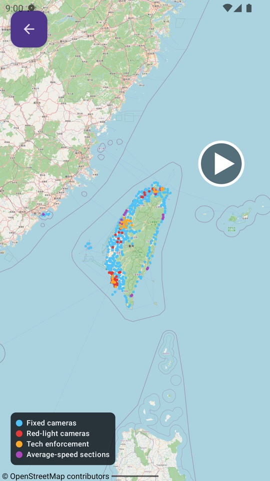
  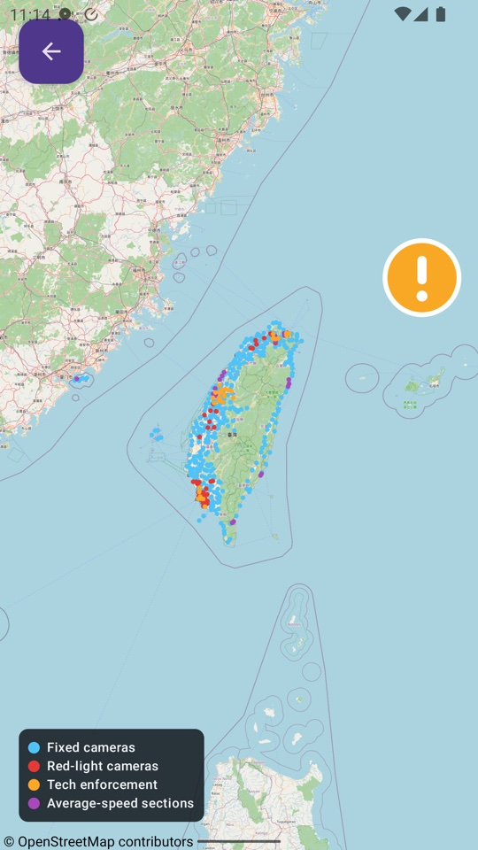
  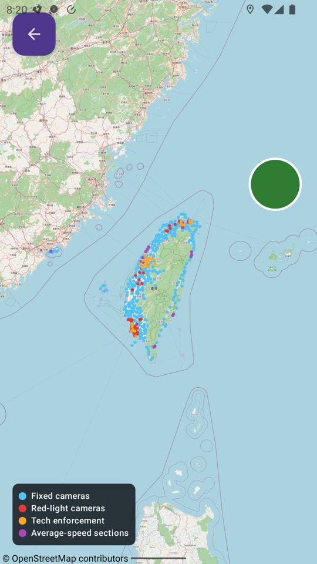
</p>
<p>
  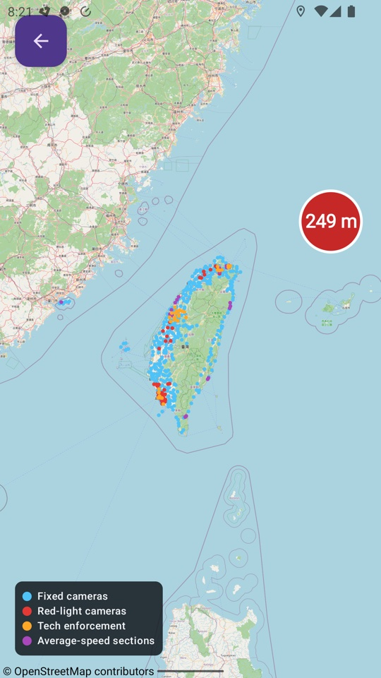
  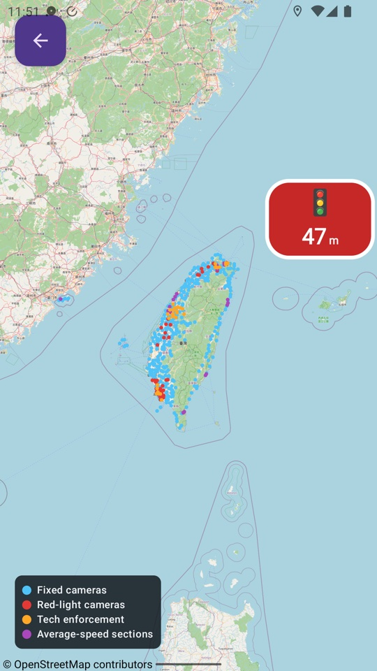
  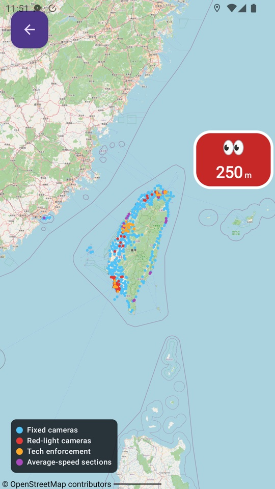
</p>
<p>
  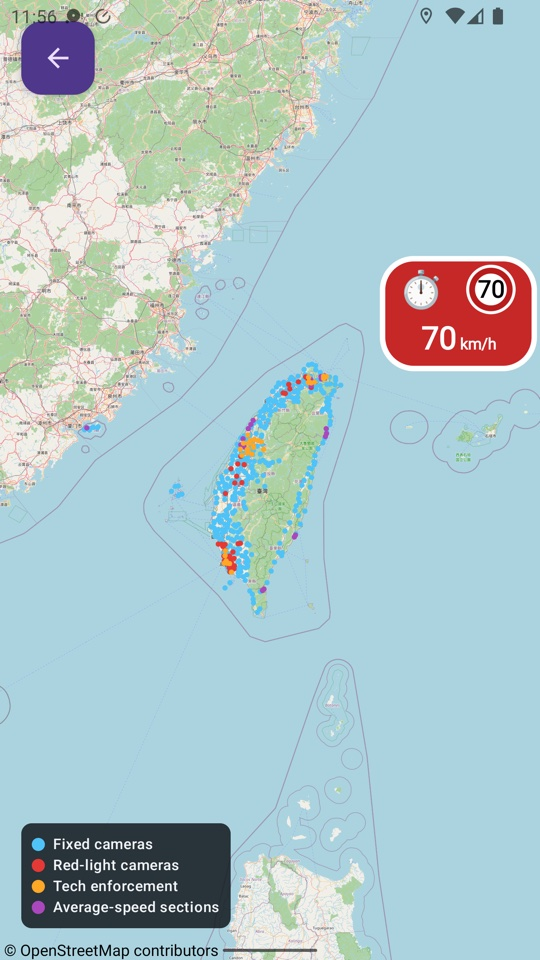
</p>

## How to install

The app is not on Google Play. Install it once through
[Obtainium](https://github.com/ImranR98/Obtainium) and it will update itself
from this repo's GitHub Releases from then on.

(In a hurry? Direct download: grab `tw-speed-trap-vX.Y.Z.apk` from
[Releases](https://github.com/gde-pass/tw-speed-trap/releases), sideload it,
then jump to step 3 — but you won't get app updates automatically.)

### 1. Install Obtainium

1. On the phone, open
   [Obtainium's latest release](https://github.com/ImranR98/Obtainium/releases/latest)
   and download **`app-arm64-v8a-release.apk`** (right for almost every
   modern phone).
2. Open the downloaded file. If Android asks, allow your browser to
   *install unknown apps* — that permission prompt appears once.
3. Open Obtainium and dismiss its welcome notes.

### 2. Add TW SpeedTrap in Obtainium

1. Tap **Add** (bottom right), paste
   `https://github.com/gde-pass/tw-speed-trap` into **App source URL**, and
   leave **Include prereleases OFF** (the `data` prerelease is the camera
   database, not an app). Tap the **+**.
2. The app page appears showing the latest version. Tap **Install**
   (bottom right), let Obtainium download the APK, and confirm the system
   dialog. (First time only: allow Obtainium to *install unknown apps*.)

<p>
  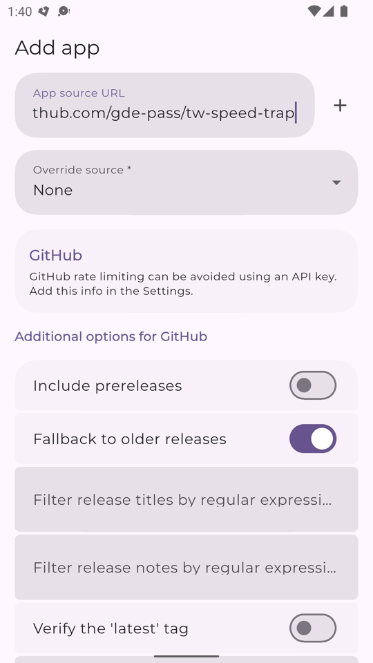
  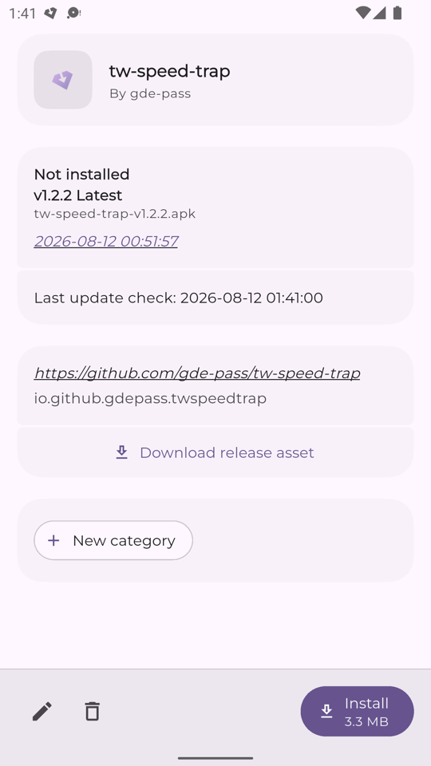
  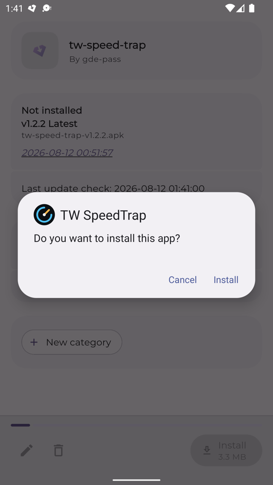
</p>

### 3. First launch — grant the permissions

Open TW SpeedTrap. The main screen walks you through each permission with a
card; the **Start detection** button unlocks as you go.

1. **Location access** → tap *Grant location*, then choose **Precise** and
   **While using the app**.

<p>
  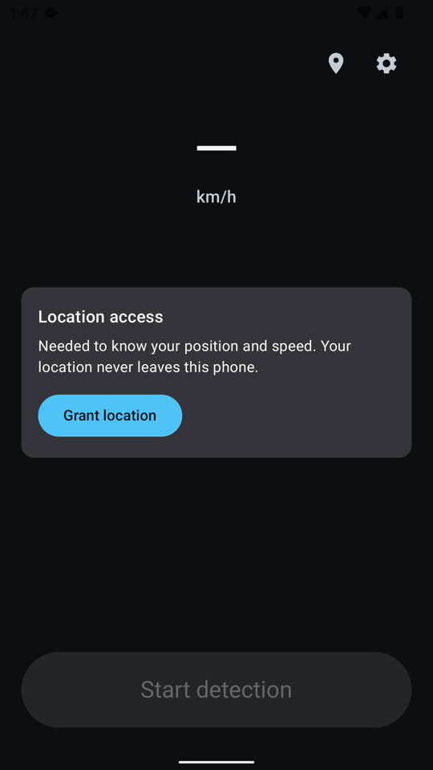
  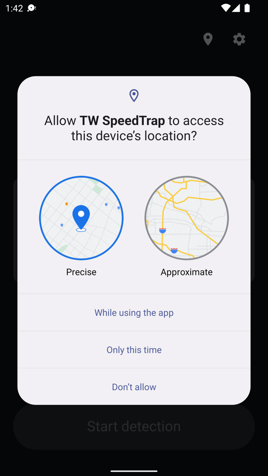
</p>

2. **Background location** → tap *Allow all the time* and pick
   **Allow all the time** on the system page that opens. This is what keeps
   alerts working with the screen off or while Google Maps is in front.
3. **Notifications** (Android 13 and newer only) → allow them; the
   persistent notification is how you see detection is alive.
4. **Battery optimisation** → tap *Disable optimisation* and confirm
   **Allow**. **Do not skip this step** — Android silently kills GPS apps
   when the screen is off unless they are exempted, and that is the
   number-one cause of missed alerts.

<p>
  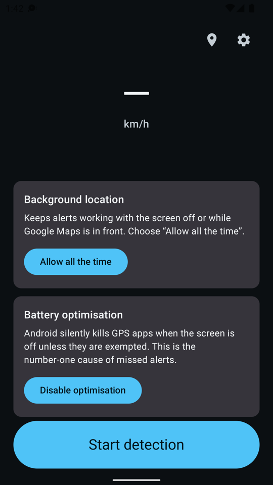
  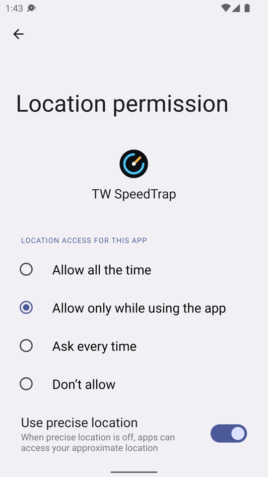
  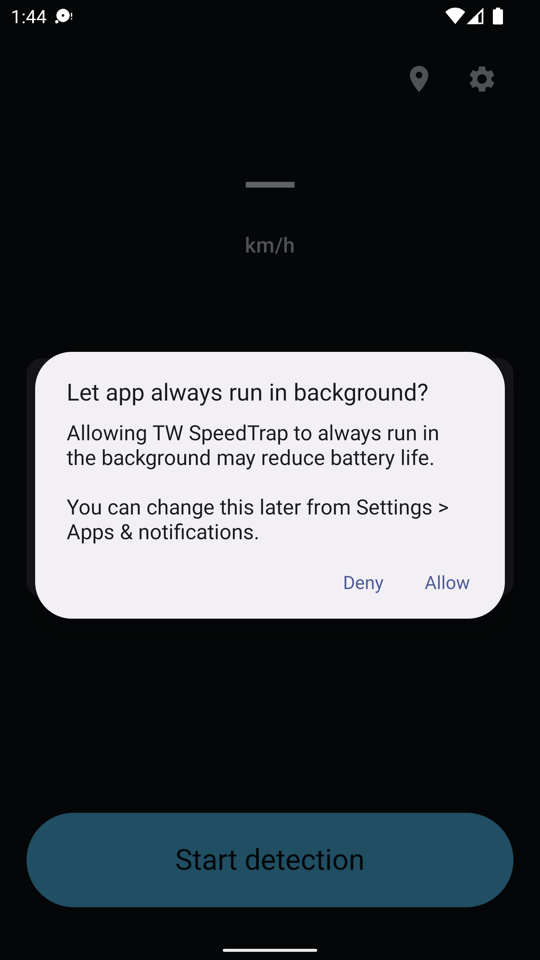
</p>

When every card is gone, the app is ready — tap **Start detection** before
riding and you're done.

<p>
  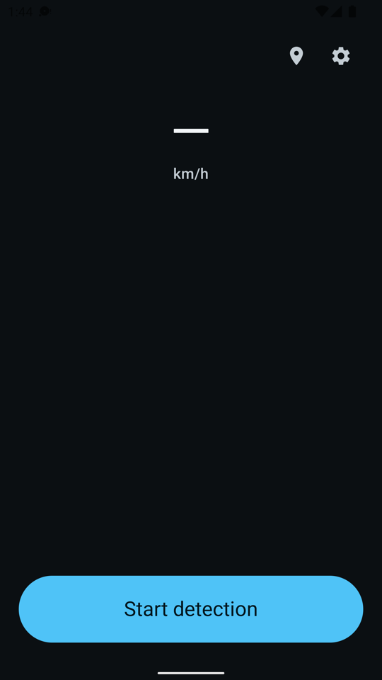
</p>

### 4. Settings worth a look

Open the gear icon (top right):

- **Language** — Français / English / system default.
- **Alert distances** — how many metres before a camera the voice fires,
  with separate sliders for below and above 100 km/h (city vs highway).
- **Speed tolerance** — how much over the limit is tolerated before the
  "slow down" warning (+10 km/h matches Taiwan's enforcement margin).
- **Chime once the camera is passed** — optional all-clear tone when the
  alerted camera falls behind you.
- **Floating bubble over other apps** — the status overlay described in
  [The floating bubble](#the-floating-bubble); grant the "display over other
  apps" permission when the settings row asks for it. It appears as soon as
  the toggle is on and works as a tap-to-start/stop control even while
  detection is off; closing the app takes it down again.
- **Stop detection after 10 min stationary** — optional auto-stop for
  forgetful riders; it announces itself before stopping.
- **Start detection when Bluetooth connects** — optional auto-start when
  your helmet intercom (or any Bluetooth device) connects; grant the
  Bluetooth permission when the settings row asks for it.
- **Announced camera types** — pick which camera families speak; each row
  carries the emoji the bubble uses for that type (📸 🚓 🚦 ⏱️ 👀), so the
  list doubles as the legend.
- **Automatic weekly update** — the camera database refreshes itself over
  Wi-Fi by default; no app update needed for new cameras.

Settings changed while detection is running apply the next time it starts —
the screen says so when that's the case.

<p>
  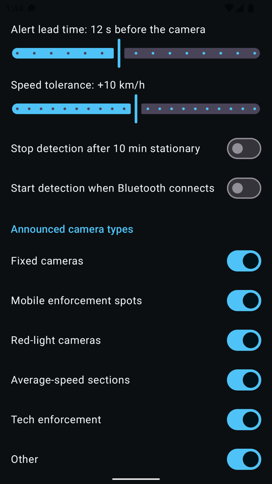
</p>

### Updating later

Obtainium notifies you when a new app version is released (one tap to
update). The camera database updates itself weekly in the background — you
never need to reinstall anything for new cameras.

## Data source and attribution

Camera locations come exclusively from Taiwanese government open data,
released under the [Open Government Data License v1.0
(政府資料開放授權條款—第1版)](https://data.gov.tw/license), which permits
derivative works with attribution:

- [測速執法設置點 (dataset 7320)](https://data.gov.tw/dataset/7320) — 內政部警政署
- [國道公路固定式測速照相地點 (dataset 13940)](https://data.gov.tw/dataset/13940)
- [臺北市固定測速照相地點表 (dataset 130111)](https://data.gov.tw/dataset/130111)
- [臺北市智慧管理科技執法設備資料表 (dataset 135957)](https://data.gov.tw/dataset/135957)
- [桃園市測速照相設備地點 (dataset 25935)](https://data.gov.tw/dataset/25935)
- [臺中市科技執法取締地點 (dataset 170673)](https://data.gov.tw/dataset/170673)
- [高雄市115年「固定式違規照相科技執法設備」設置地點一覽表 (dataset 176549)](https://data.gov.tw/dataset/176549)
- [高雄市115年不停讓行人科技執法監測系統設置地點 (dataset 176555)](https://data.gov.tw/dataset/176555)
- [高雄市115年交通局建置科技執法設備設置地點 (dataset 176558)](https://data.gov.tw/dataset/176558)
- [高雄市115年捷運局輕軌沿線建置科技執法設備設置地點 (dataset 176560)](https://data.gov.tw/dataset/176560)
- [高雄市115年路口科技執法監測系統設置地點 (dataset 176561)](https://data.gov.tw/dataset/176561)
- [高雄市115年租賃式車不停讓行人科技執法地點 (dataset 177827)](https://data.gov.tw/dataset/177827)
- [彰化縣警察局固定式科技執法設備設置地點 (dataset 172905)](https://data.gov.tw/dataset/172905)
- [1150715雲林縣警察局固定式測速照相設備設置地點一覽表 (dataset 178085)](https://data.gov.tw/dataset/178085)
- [1150715雲林縣警察局科技執法設備設置地點一覽表 (dataset 178086)](https://data.gov.tw/dataset/178086)
- [基隆市科技執法取締地點 (dataset 178159)](https://data.gov.tw/dataset/178159)
- [澎湖縣固定測速照相設置地點表 (dataset 156415)](https://data.gov.tw/dataset/156415)
- [澎湖縣科技執法地點 (dataset 172940)](https://data.gov.tw/dataset/172940)
- [國道公路警察局闖紅燈照相地點 (dataset 100856)](https://data.gov.tw/dataset/100856)
- [桃園市科技執法設備地點 (dataset 178168)](https://data.gov.tw/dataset/178168)
- [苗栗縣固定式闖紅燈、測速照相設備取締地點 (dataset 172174)](https://data.gov.tw/dataset/172174)
- [屏東縣科技執法路段及項目 (dataset 159972)](https://data.gov.tw/dataset/159972)
- [新竹市科技執法點位資訊 (dataset 178144)](https://data.gov.tw/dataset/178144)

資料來源：政府資料開放平臺 (data.gov.tw)。

This is a clean-room implementation: no data, code, assets, or audio from
any other speed-camera app is used. Map tiles © OpenStreetMap contributors.

## Building

Requirements: JDK 21, Android SDK platform 37.

```sh
./gradlew assembleDebug                                   # debug APK
./gradlew :detection:test :app:testDebugUnitTest          # unit + replay tests
./gradlew ktlintCheck detekt                              # lint
```

Release signing is environment-driven — see [docs/signing.md](docs/signing.md).
Releases are cut by pushing a `vX.Y.Z` tag; CI signs the APK and attaches it
to a GitHub Release.

## Repository layout

- `app/` — Android app (Compose, single activity; foreground detection
  service; TTS announcer; DataStore settings; WorkManager updater)
- `detection/` — pure-JVM alert engine (grid index, hysteresis, bearing
  filter, average-speed tracker) + GPX replay harness and its sample track
- `pipeline/` — Python data pipeline (uv): fetch → decode → reproject →
  dedupe → SQLite/GeoJSON/manifest. See [pipeline/README.md](pipeline/README.md)
- `data/` — committed GeoJSON snapshot of the camera database
- `docs/` — [signing](docs/signing.md), [mock-location
  testing](docs/mock-location.md), [ride QA checklist](docs/qa-checklist.md),
  [roadmap](docs/roadmap.md)
- `.github/workflows/` — CI, weekly data update, tag-triggered release

The camera database is refreshed weekly by CI; when the data changes, the
new SQLite + manifest replace the assets on the rolling
[`data` prerelease](https://github.com/gde-pass/tw-speed-trap/releases/tag/data)
and the app picks them up on its next check.

## Testing without riding

- `detection/` replay harness runs a GPX track through the engine in plain
  JUnit — see `GpxReplayTest`.
- On-device: [docs/mock-location.md](docs/mock-location.md).
- Real-route checklist: [docs/qa-checklist.md](docs/qa-checklist.md).

## License

- **Code:** [MIT](LICENSE).
- **Camera data:** [政府資料開放授權條款—第1版](https://data.gov.tw/license)
  (Taiwan Open Government Data License v1.0) — separate from the code
  license.
